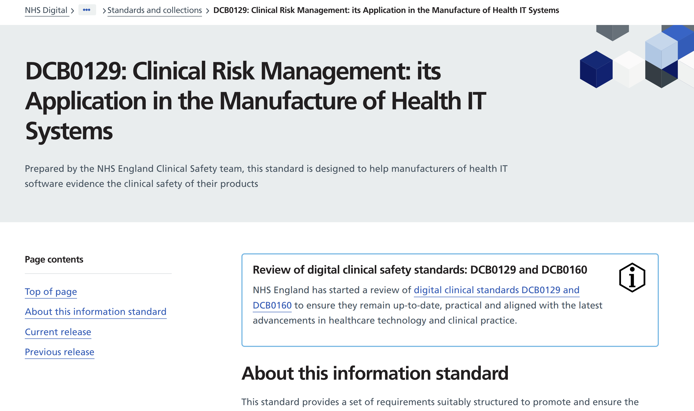
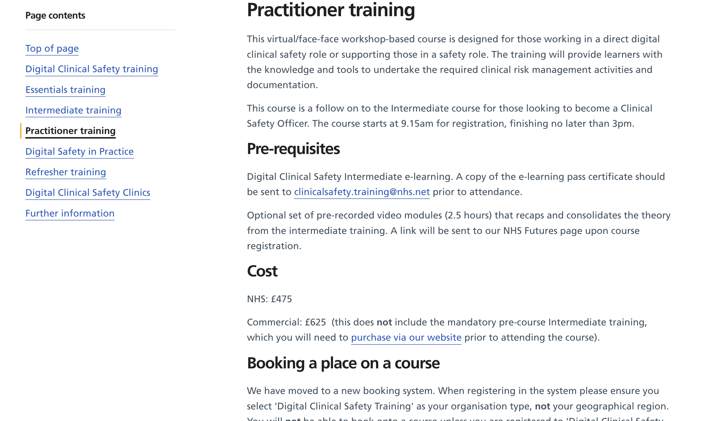
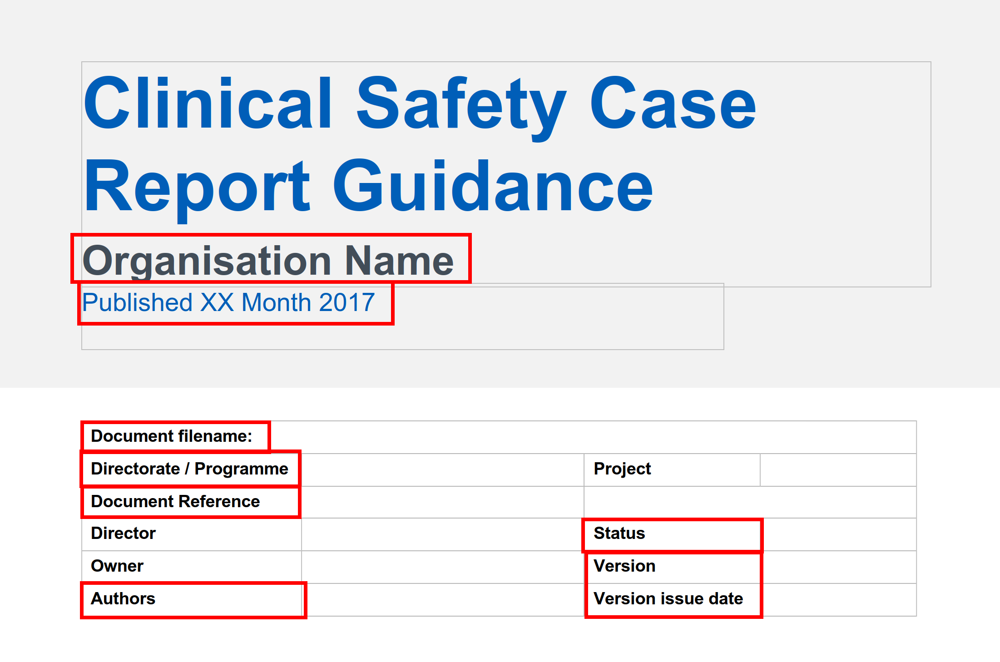
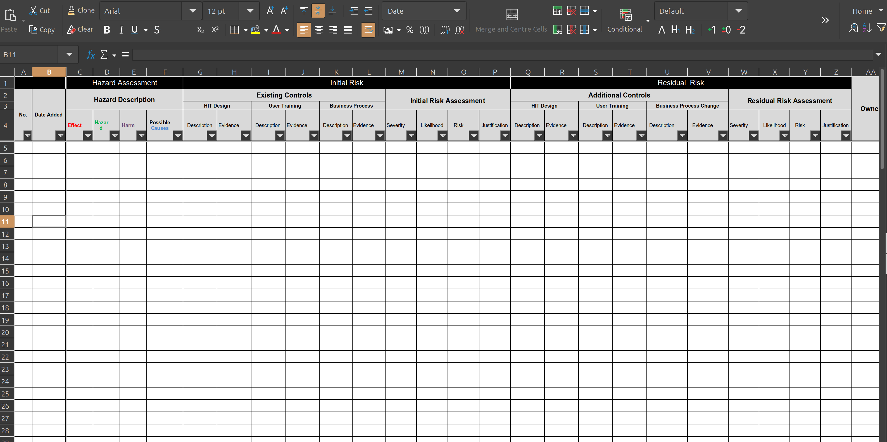
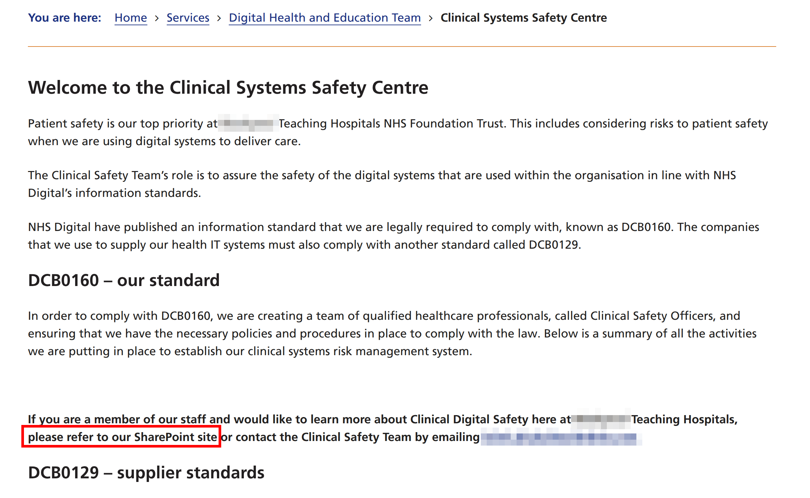
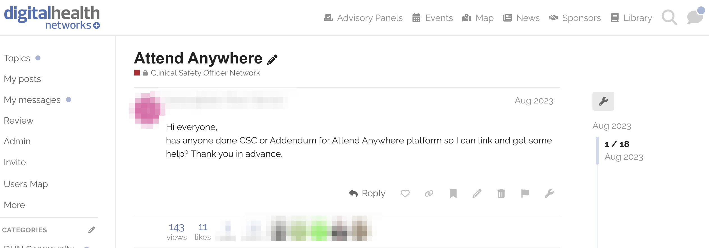
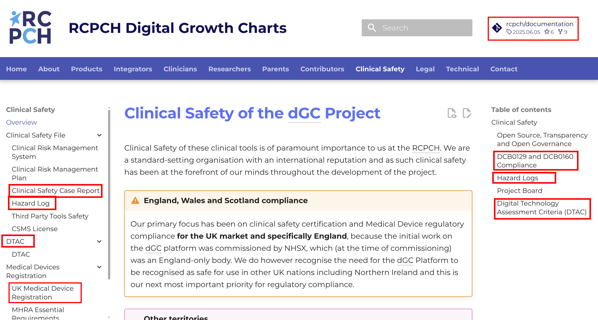
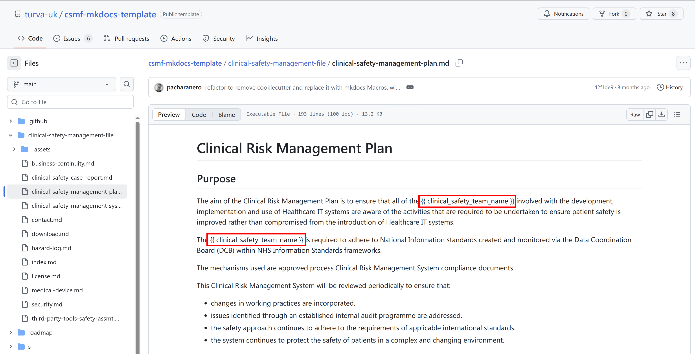
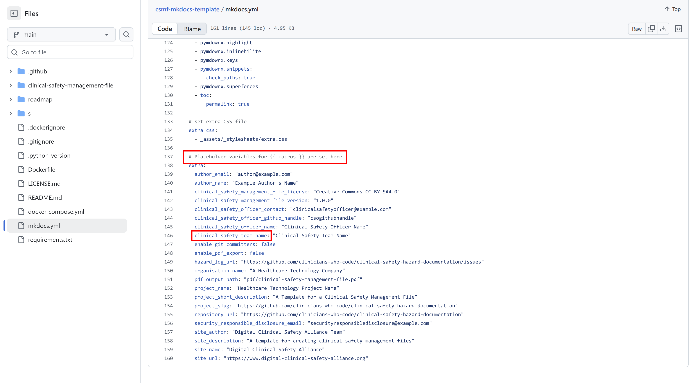
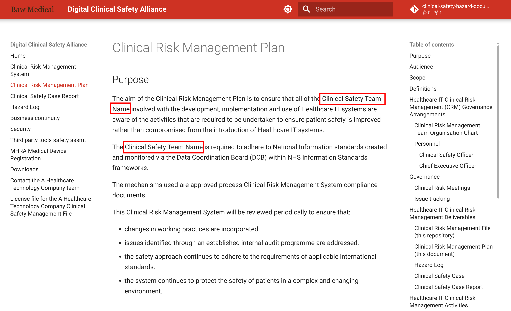

# DR MARCUS BAW
### 'GENERAL HACKTITIONER'
### OPEN SOURCE CAMPAIGNER
### CLINICAL SAFETY OFFICER
### SOFTWARE DEVELOPER @ RCPCH INCUBATOR
### PAST CHAIR @ RCGP HEALTH INFORMATICS GROUP

-----

## **NOTHING** IN THIS PRESENTATION IS "CUTTING EDGE", IT IS ALL BASED ON USING STANDARD SOFTWARE DEVELOPMENT PRACTICES FOR MANAGING CLINICAL SAFETY INFORMATION

-----

# CLINICAL SAFETY
# SHOULD BE BETTER <!-- .element: class="fragment fade-in" -->
# IN 2025

---

### DCB0129 and DCB0160 (HSCA 2012)

---

### go on the course

---

# SO FAR SO GOOD

---

### fill in a Word document?

---

### manage hazards in an Excel spreadsheet?

---

### hide them in your sharepoint?

---

## what do they do internally at NHS digital/england/NHSX/DHSC?

### no central orgs have a good system for this <!-- .element: class="fragment fade-in" -->

---

### See what the rest of the industry does?

-----

# What's Wrong with Current Practice?

---

## DOCUMENTATION

#### Word is a 1990s way to do the docs <!-- .element: class="fragment" -->
#### Excessive focus on documentation over safety <!-- .element: class="fragment" -->
#### Manual find-and-replace for placeholder text <!-- .element: class="fragment" -->
#### Manual, and essentially optional, version control <!-- .element: class="fragment" -->
#### Discourages iteration <!-- .element: class="fragment" -->
#### Hard separation from Agile development process <!-- .element: class="fragment" -->

---

## HAZARDS 

#### Excel is an unsafe way to handle hazards <!-- .element: class="fragment" -->
#### Excel is NOT designed for text <!-- .element: class="fragment" -->
#### Very easy to accidentally delete an entire row (a whole hazard!) <!-- .element: class="fragment" -->
#### Impossible to let others comment on a Hazard <!-- .element: class="fragment" -->
#### no way to share or broadcast serious hazards to other orgs <!-- .element: class="fragment" -->
#### Hazards separated from software development processes  <!-- .element: class="fragment" -->

---

## UNPUBLISHED

#### Nobody outside your organisation can see them <!-- .element: class="fragment" -->
#### Focus is on creative writing which nobody will read or review  <!-- .element: class="fragment" -->
#### Culture of "commercial in confidence" and reluctance to share - even with implementing trusts! <!-- .element: class="fragment" -->
#### Prevents reuse of the same work in similar implementations <!-- .element: class="fragment" -->
#### Impossible to federate up and down to other orgs <!-- .element: class="fragment" -->
#### No peer review possible <!-- .element: class="fragment" -->

---

## Clinical Safety 'Theatre'

### I would argue that current practice, while compliant with the legal requirements, is not really contributing to patient safety as much as it could be, and thus could be considered clinical safety 'theatre'

---

### Daylight is the Best Disinfectant

#### When documentation is public, everyone can see it - which means there's no 'hiding' an inconvenient hazard <!-- .element: class="fragment" --> 
#### Important hazards identified by one org can be seen and mitigated by others <!-- .element: class="fragment" -->
#### When documentation is private, there's no external pressure to raise standards

-----

# SURELY WE CAN DO THIS BETTER?

---

### We want safety processes that
#### Actually make the software safer <!-- .element: class="fragment" -->
#### Are close to the code itself <!-- .element: class="fragment" -->
#### Evolve with the software <!-- .element: class="fragment" -->
#### Are transparent by default <!-- .element: class="fragment" -->
#### Careful understanding of hazards <!-- .element: class="fragment" -->
#### Hazard workshops and the resulting actions <!-- .element: class="fragment" -->
#### Working out what needs to change <!-- .element: class="fragment" -->

-----

## RCPCH Digital Growth Charts

---

[git](https://git-scm.com/) - **version control** and **attribution**

[github](https://github.com/) - use GitHub Issues for the **Hazards**

[markdown](https://en.wikipedia.org/wiki/Markdown) - all the content is written in a simple text format

[material for mkdocs](https://squidfunk.github.io/mkdocs-material/) - static site framework to turn markdown into a website

[PUBLISH!](https://growth.rcpch.ac.uk)

---

## Markdown & MkDocs GitHub Template repo

### [csmf-mkdocs-template](https://github.com/turva-uk/csmf-mkdocs-template)

---

#### convert Word docs to markdown in git-based version control

---

#### add templating

---

#### make it easy to publish as a website

---

# use what software teams use

#### your developers are all already using Git
#### your developers have some kind of source control server (eg GitHub)
#### your developers all have some way to flag Issues
#### just hook into these for clinical safety

-----

# BUT IT'S ALL TOO TECHY

---

-----

## made with

#### [reveal.js](https://github.com/hakimel/reveal.js)
#### and
#### [CREATE-NEW-REVEAL.JS](https://github.com/pacharanero/create-new-revealjs-template)
